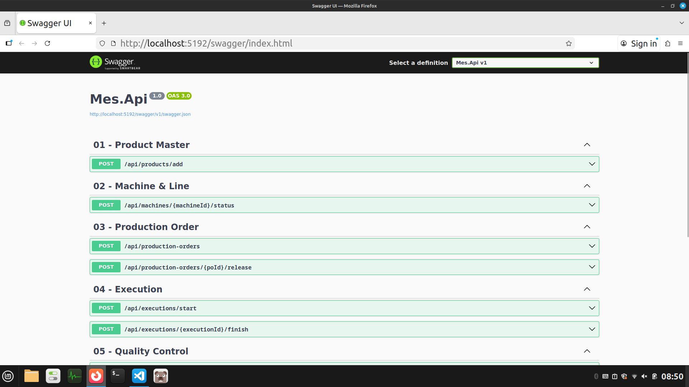

# MES
<!-- 
## Mes Api

- [swagger](http://localhost:5192/swagger/index.html) -->

## Overview
A professional Manufacturing Execution System (MES) built with **C#** and **ASP.NET** to manage factory operations and data flow.

## Key Features
- **Data Visualization:** Real-time production tracking.
- **Database Management:** Efficient SQL queries for large manufacturing datasets.
- **User Authentication:** Secure login for different operator levels.

## Tech Stack
- **Language:** C# (.NET)
- **UI Framework:** Web UI (Razor Pages)
- **Database:** Microsoft SQL Server
<!-- - **Architectural Pattern:** MVVM / OOP -->

## How to Run
1. Clone the repo
2. Update Connection String in `Mes.Api\appsettings.json`
3. Run `setup.sh`, `run.sh`